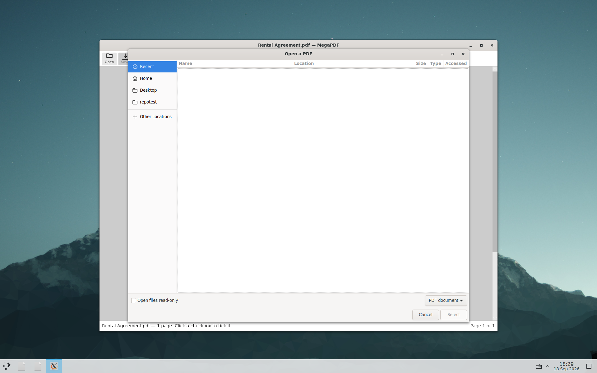

# Linux app — screen inventory and QA checklist (#158)

Every window, dialog, menu, mode, notice, busy state and error the Avalonia Linux app
can show. Tick a row when it has been *seen* — in the language, theme and window width
the pass is covering — not merely when the code that would show it exists.

Run the pass once per **language** (en, fr-CA, fr-FR) × **theme** (light, dark), and the
layout-sensitive rows again at each **width** (1280, 1000, 800, 480 = the minimum,
`MainWindow.axaml:10`).

**Look for:** clipping, overlap, untranslated text, the wrong theme, broken layout, and
text that runs into or under a neighbour.

The 2026-09-18 pass is recorded in the **Seen** column: ✅ captured and looked at,
**hands** for the rows that need a pointer and so were not reachable, and a note where
something else stood in.

## How to pose each screen

The app renders its own window to a bitmap rather than letting anything photograph the
screen, so no compositor grant is involved and the capture is the window alone.

```
. tools/../<session with X, a window manager, dbus and the portal>
APP=artifacts/linux/MegaPDF/bin/MegaPDF          # or, from the package:
FP="flatpak run --user --filesystem=$FIX:ro --filesystem=$OUT \
      --command=/app/lib/megapdf/MegaPDF ca.electricrv.MegaPDF"

$APP --window 1280x800 --language fr-CA --theme dark \
     --screenshot-state more --screenshot out.png "$FIX/demo-fr.pdf"
```

`--screenshot-state` accepts `sign find focus more textbox redact busy busy-page
busy-line unsaved mode about notices` (`App.axaml.cs:37`). `unsaved`, `about` and
`notices` render their dialog beside the window to `<out>-dialog.png`. `sign` needs
`--signature <png|jpg>` when the library is empty and the app is not running from a
checkout. Everything else in the tables below has no pose and needs a real pointer.

Because the app renders its own window, **a capture cannot depend on which window
manager is running**: the GNOME and KDE sets would be identical by construction. What
the second desktop is for is everything around the window — see §10.

---

## 1. Windows

| # | Screen | How to reach it | Posed by | Seen |
|---|---|---|---|---|
| 1.1 | Empty state — title, tagline, "Open a PDF…", Recent list with each file's location | launch with no file | `--screenshot` with no pdf | ✅ |
| 1.2 | Document open, Select mode | open any PDF | `--screenshot` | ✅ |
| 1.3 | Document open at the minimum width (480×360) | drag the window in | `--window 480x360` | ✅ |
| 1.4 | Restricted banner + **Unlock…** | open an owner-restricted document (`encrypted.pdf`) | real window | hands |
| 1.5 | Window title dirty bullet (`•`) | make any edit | `--screenshot-state unsaved` | ✅ |
| 1.6 | Window title and `WM_CLASS` | any window | `wmctrl -l -x` | ✅ §10 |

## 2. Dialogs (separate windows, centred on the owner)

| # | Dialog | Buttons | How to reach it | Posed by | Seen |
|---|---|---|---|---|---|
| 2.1 | **Unsaved changes** — "Do you want to save the changes made to the document "{0}"?" | Don't Save / Cancel / **Save** | edit, then Close or Ctrl+Q | `--screenshot-state unsaved` → `<out>-dialog.png` | ✅ |
| 2.2 | **Restore unsaved work** (recovery) | Discard them / Decide later / **Restore** | kill the app mid-edit, relaunch | real window | journal verified, §9 |
| 2.3 | **Key needed** to open a protected file | Cancel / **Open** | open a user-protected PDF | real window | hands |
| 2.4 | **Unlock document** (owner credential) — same window, relabelled | Cancel / **Unlock** | **Unlock…** in the restricted banner | real window | hands |
| 2.5 | Retry text after a wrong entry | Cancel / **Open** | type the wrong thing | real window | hands |
| 2.6 | **Document protection — manage panel** | Cancel / Remove / Change… | File ▸ Protection… on a protected file | real window | hands |
| 2.7 | **Document protection — entry panel** (New / Confirm) | Cancel / Set \| Change | File ▸ Protection… on an unprotected file | real window | hands |
| 2.8 | Entry-panel inline problems — empty and mismatch | — | commit an empty or mismatched pair | real window | hands |
| 2.9 | **Add a signature** (draw pad) | Clear / Cancel / **Save** | Sign ▸ Draw | real window | hands |
| 2.10 | **Type your name** — live script preview | Cancel / **Add** | Sign ▸ Type | real window | hands |
| 2.11 | **Rename signature** | Cancel / **Rename** | signature card ⋯ ▸ Rename… | real window | hands |
| 2.12 | **Delete signature** | Cancel / Delete (danger) | signature card ⋯ ▸ Delete… | real window | hands |
| 2.13 | **Print** — which printer, how many copies | Cancel / **Print** | Print, with a CUPS queue present | real window | hands; the CUPS route is §8 |
| 2.14 | **About MegaPDF** — icon, version, copyright, GitHub link, Third-party notices… | — | Help ▸ About | `--screenshot-state about` | ✅ |
| 2.15 | **Third-party notices** — the licence text | — | About ▸ Third-party notices… | `--screenshot-state notices` | ✅ |

## 3. Menus

| # | Menu | Contents | Seen |
|---|---|---|---|
| 3.1 | The menu bar, in the window | File / Edit / View / Tools / Window / Help (`MainWindow.MenuBar.cs`) | ✅ asserted by `--self-test` |
| 3.2 | Every toolbar, More and zoom command reachable from it | 22 commands | ✅ asserted by `--self-test` |
| 3.3 | **More** (•••) — Save As, Password…, Print, Shrink, Options, plus anything overflowed | | ✅ at 1280/1000/800/480 |
| 3.4 | Zoom menu — the presets, Fit width, Fit page, Actual size | | hands (the flyout is its own window) |
| 3.5 | Signature card ⋯ — Rename…, Delete… | | hands |
| 3.6 | Recent item context menu — Show in file manager | | hands |

Command key is **Ctrl** (`Shortcut(...)`, `MainWindow.MenuBar.cs:42`); Redo is **Ctrl+Y**
off macOS, not Ctrl+Shift+Z.

## 4. Toolbar and find-bar layout steps

| # | Width | What the toolbar does | Seen |
|---|---|---|---|
| 4.1 | 1280 | every command with its label; zoom −, level, + | ✅ |
| 4.2 | 1000 | labels still on in English and French | ✅ |
| 4.3 | 800 | labels gone, icons only; zoom fits to 94 % | ✅ |
| 4.4 | 480 (minimum) | icons only and commands moved into More; Open never leaves | ✅ |
| 4.5 | the font and size pickers, while a text box is selected | they take a place in the row down to 800 | ✅ |

The find bar sheds detail on the same principle, measured in the running language
(`MainWindow.FindBar.cs`, #237). Done is measured first and never gives anything up —
it is the only pointer-driven way out of find.

| # | Width | What the find bar does | Seen |
|---|---|---|---|
| 4.6 | 1280 / 1000 / 800 | **Previous** and **Next** spelled out, the box at 260 | ✅ |
| 4.7 | 480 (minimum) | the two buttons become a chevron each, keeping their word as their accessible name and their tooltip; the box narrows to what is left (243 in English, 214 in French); the counter reads in full | ✅ |

## 5. Modes and their banners

| # | Mode | Banner | Seen |
|---|---|---|---|
| 5.1 | Add text | "Click where the new text goes — Esc cancels" | ✅ `--screenshot-state mode` |
| 5.2 | Sign — placing | "Click where the signature goes — Esc cancels" | ✅ via `sign` then place |
| 5.3 | Cover | "Drag across what you want to hide. Esc cancels. Cover removes nothing: Redact does" | hands |
| 5.4 | **Redact** (#173) | "Drag across what you want removed, or select text — Esc cancels", with a mark placed | ✅ `--screenshot-state redact` |
| 5.5 | A selected text box — move, edit, delete hint on the status line | | ✅ `--screenshot-state textbox` |
| 5.6 | The keyboard focus ring on a page region | | ✅ `--screenshot-state focus` |

## 6. Busy states, notices and selection chrome

| # | State | Seen |
|---|---|---|
| 6.1 | Busy strip under the toolbar ("Checking the saved file…"), toolbar disabled | ✅ `busy` |
| 6.2 | Page-level spinner ("Checking this page…") | ✅ `busy-page` |
| 6.3 | Line-level spinner | ✅ `busy-line` — the toolbar disables; the indicator itself is too brief to catch in a still |
| 6.4 | Search hits — cyan for every match, brand blue for the current one, "1 of 3" | ✅ `find`, en and fr |
| 6.5 | Restricted-document banner | hands |

## 7. Errors (all via the status line unless noted)

Not reachable without a pointer or a broken file to hand; the strings are in
`Strings.resx` and the shared wording is asserted by the string-catalogue tests. The
Linux-specific ones worth naming:

| # | Where | What it says |
|---|---|---|
| 7.1 | Print, in a Flatpak | printing needs the portal route, which is not built — the app detects `/.flatpak-info` and says so rather than failing obscurely |
| 7.2 | Save | "Could not save. Writing the PDF failed." — the #193 case; a large save no longer reaches it |
| 7.3 | Startup, no writable data directory | "MegaPDF could not create the folder it keeps your settings in: …" (#195) |
| 7.4 | Page | "This page couldn't be displayed." |

## 8. Flows walked with real files (#158)

The review form (`tools/gen_review_form.py`), the fixtures (`tools/gen_test_fixtures.py`,
`tools/gen_redaction_fixtures.py`) and the large set (`tools/gen_large_fixtures.py`).

Rows marked **self-test** are driven through the real `MainViewModel` by
`MegaPDF --self-test <fixtures>`, which is the same code path a click takes and asserts
the outcome rather than photographing it.

- [x] open — argv, the installed launcher on PATH, and from inside the Flatpak sandbox
- [x] scroll — every page of a 1,000-page and a 10,000-page document (battery, §11)
- [x] zoom — a preset applies and the button reads it (**self-test**); fit at 94 % seen at 800 px
- [x] find — a hit, no hit, wrap-around, case-insensitivity, the counter (**self-test**), and posed in three languages
- [x] tick a checkbox — a real AcroForm widget and a drawn square (**self-test**)
- [x] sign — place, size, aspect, centring, undo (**self-test**); the library flyout posed
- [x] add text — placement, the face and size pickers, restyle, undo (**self-test**)
- [x] cover (**self-test**)
- [x] **redact** (#173) — arm, mark, the guard's verdict, save-with-marks carries none, apply (**self-test**), and posed
- [x] edit body text — 22,267 line edits across the corpus with 0 changes against the baseline (§11)
- [x] undo and redo (**self-test**)
- [x] save, and save as (**self-test**, including a save that fails while making the bytes and leaves the original untouched)
- [ ] set protection, then remove it — **hands**: the dialog is the only way in. The engine side is covered by `SecurityTests` in the Core suite.
- [x] shrink — availability re-evaluated after a flatten (**self-test**)
- [x] print through CUPS — a queue made, `lp` accepted the document, the app's `--print-check` reads the queue back (§10)
- [x] close with unsaved changes — the dialog, and the journal kept (D1) (**self-test**)
- [x] recovery after a kill — a journal is written while the edit is live, survives `kill -9`, and the app relaunches with it present (§10)

### Peak memory, against the Windows figures on #147

App, opening the document and rendering the first page (`/usr/bin/time -v`, 1440×900):

| document | file | Linux app peak RSS | ratio |
|---|---:|---:|---|
| `demo.pdf` (1 page) | 0.1 MB | 214 MB | — |
| `deep-10000.pdf` (10,000 pages) | 6 MB | 263 MB | — |
| `big-1gb.pdf` (400 pages) | 1,049 MB | 222 MB | 0.21x |
| `huge-2_5gb.pdf` (1,000 pages) | 2,685 MB | **228 MB** | **0.09x** |

A 2.5 GB document costs **14 MB more than a one-page one**. Windows on #147 was a 266 MB
working set at open on the same file, peaking at 441 MB through a scroll to page 1000.

Engine, through the whole battery on one document — every page rendered, zoom extremes,
whole-document search, save and reopen:

| document | peak | ratio |
|---|---:|---|
| `huge-2_5gb.pdf` | 189 MB | 0.07x |
| `big-1gb.pdf` | 126 MB | 0.12x |

## 9. Packaging and the sandbox

| # | Check | Seen |
|---|---|---|
| 9.1 | The Flatpak's granted permissions are `ipc`, `x11`, `dri` and nothing else | ✅ |
| 9.2 | A file in the real home is **not** readable from inside the sandbox | ✅ |
| 9.3 | `org.freedesktop.portal.FileChooser` answers from inside the sandbox | ✅ |
| 9.4 | Which provider a dialog actually uses | ✅ — **the portal**, see below |
| 9.5 | The third-party notices are in the package, beside the binary | ✅ |
| 9.6 | The engine loads from `$ORIGIN` and nothing else | ✅ |
| 9.7 | The `.deb` installs on a machine with no .NET, ICU or X libraries | ✅ |
| 9.8 | The `.desktop` entry validates, offers `application/pdf`, and claims nothing | ✅ |
| 9.9 | All nine hicolor icon sizes and the scalable icon are installed | ✅ — **this was broken; see the defects** |
| 9.10 | A document opened through the portal reopens after the app restarts | ✅ |
| 9.11 | …and after `xdg-document-portal` itself restarts | ✅ |

### 9.4 — which dialog opens, settled (#254 A4)

This row said "no startup inspection can tell them apart". True, and beside the point:
the dialog does not have to be inspected at startup, it has to be watched when it opens.
`tools/linux/qa/filechooser-check.sh <gnome|gtk|kde> <app-tree>` does that, and two
independent things say the same answer.

**The session bus.** A portal dialog is a method call; Avalonia's own fallback makes none.

```
interface=org.freedesktop.portal.FileChooser;      member=OpenFile
interface=org.freedesktop.impl.portal.FileChooser; member=OpenFile
interface=org.freedesktop.portal.FileChooser;      member=SaveFile
interface=org.freedesktop.impl.portal.FileChooser; member=SaveFile
```

**The window list.** The dialog belongs to the *backend* process, not to MegaPDF:

```
0x0280000f  0 MegaPDF.MegaPDF                                Rental Agreement.pdf — MegaPDF
0x02e00003  0 xdg-desktop-portal-gtk.Xdg-desktop-portal-gtk  Open a PDF
0x02e02579  0 xdg-desktop-portal-gtk.Xdg-desktop-portal-gtk  Save a copy
```

and under KDE, with its own backend answering:

```
0x0260000a  0 xdg-desktop-portal-kde.xdg-desktop-portal-kde  Open a PDF — Portal
```

Both dialogs carry the titles MegaPDF passed — "Open a PDF", "Save a copy" — so the app
is reaching the portal, and the portal is reaching the desktop.



Reached by clicking the toolbar's **Open** button with `xdotool`, in a real Plasma
session: MegaPDF's window behind, the desktop's own file chooser in front, with its
sidebar, its `PDF document` filter and its **Open files read-only** box — none of which
MegaPDF draws or knows about.

**What is still hands:** picking a file in that dialog and seeing the app open what came
back. One Open and one Save on a real desktop; `tools/Linux-Packaging.md` has the
command.

### 9.10 and 9.11 — a recent document after a restart (#254 A4)

`tools/linux/qa/recent-sandbox-check.sh <bundle.flatpak>` asks
`org.freedesktop.portal.Documents` for a handle and grants it to the app, which is what
the FileChooser portal does when someone picks a file, and then restarts things. Inside
the sandbox:

- the app records `/run/user/1000/doc/<id>/<name>.pdf`, with an Avalonia bookmark that
  wraps the same string and adds nothing;
- that path opens after the app has quit and started again;
- it still opens after `xdg-document-portal` has been restarted, because the document
  store is a database on disk;
- the same file by its **real** path is `No such file or directory` from inside the
  sandbox, while the granted path lists normally — so what is being measured is the
  permission, not the filesystem.

The packaging runbook and the Flatpak manifest both used to say handles did not survive a
restart. They do; both have been corrected.

## 10. The second desktop

### KDE: a whole Plasma session (#254 A5)

```sh
tools/linux/qa/kde-smoke.sh artifacts/linux/MegaPDF
```

This section used to say that `gnome-shell` and `plasmashell` both "want systemd, logind
and a seat", so only the window managers were run. Half of that is right. **GNOME Shell
46.0 aborts** in `background.js` on its first call to `org.freedesktop.login1`, which a
container has no systemd-logind to answer, and there is no way round it short of running
systemd as PID 1. **`startplasma-x11` simply comes up**, with no systemd at all:

```
    kwin_x11       running
    plasmashell    running
    kded5          running
    ksmserver      running
    window manager: KWin
    the shell's own windows:
        0x01e00015 -1 plasmashell.plasmashell  Desktop @ QRect(0,0 1920x1200) — Plasma
        0x01e0001b -1 plasmashell.plasmashell  Plasma
```

So the KDE pass is now the whole desktop — the shell that draws the panel and the
wallpaper, the compositor that places the window, `kded5`, `ksmserver`, and
`xdg-desktop-portal-kde` answering for the file dialogs. Run 2026-09-18, all green:

| | |
|---|---|
| `--self-test` | PASS — fill, check, sign, save, reopen |
| `--render-check` | PASS — `demo.pdf`, page 1 → 816×1056 px |
| `--language-check` | PASS — `LANGUAGE=fr_CA` read through the POSIX chain |
| `--print-check` | PASS — `org.freedesktop.portal.Print` version 2 is on this session's bus |
| the window | `WM_CLASS` `"MegaPDF", "MegaPDF"`, title `Rental Agreement.pdf — MegaPDF`, 1280×800 **placed by kwin at (320, 206)** on a 1920×1200 screen |
| the toolbar | `mode=Full, pickers=absent, height=49 DIP`, one row |
| the menu bar | PASS — all 22 toolbar, More and zoom-menu commands present |
| the file dialogs | `OpenFile` and `SaveFile` on the bus, handed to `org.freedesktop.impl.portal.FileChooser`, and the dialog is a window of `xdg-desktop-portal-kde` titled `Open a PDF — Portal` |

The placement line is the one thing a window manager alone would not have proved: a real
Plasma session centred the window on the screen, rather than leaving it at the origin.

### GNOME: the window manager and the portal, not the shell

`mutter --x11` with `xdg-desktop-portal` and its GTK backend, as before. The same checks
pass, and §9.4 has the file-dialog evidence and a screenshot of the GTK portal's own
chooser over MegaPDF's window. What is missing is gnome-shell itself, for the reason
above.

Because the app renders its own window to a bitmap, **a capture cannot depend on which
desktop is running**: the GNOME and KDE screenshot sets are identical by construction.
What the second desktop is for is everything around the window, which is what the table
above measures.

**What this still does not cover:** picking a file in the dialog and seeing the app open
what came back, gnome-shell's own presentation of the app, and anything else needing a
pointer on a real screen. The rows marked **hands** above are the list to walk when there
is one.

## 11. The battery

`MegaPDF.Stress run --root <corpus> --extra-root <large set> --phases edits`, 4,337
corpus documents plus the 13 generated large ones, 12 workers, on the #157 harness.

Against the stored `core-edits-p25` baseline: **document outcome changes: none;
22,267 edits compared, 0 changes**; no read-back failures, no crashes, no hangs.
Outcomes `{'ok': 4263, 'format': 62, 'encrypted': 12}` on the shared documents, and all
13 large files `ok` — including `huge-2_5gb.pdf`, which no battery could open before #157.

## 12. Defects this pass found

1 and 3 are fixed on the branch that carries this file. 2 was found here and fixed on
main by the #146 store-capture work while this pass was running, with a better fix than
the one this branch had written: theirs also fills the find box, because searching the
view model directly leaves the capture showing an empty-looking field beside "1 of 3".

1. **The `.deb`'s icons were installed outside any icon theme.** Every size landed at
   `/usr/share/icons/48x48/apps/megapdf.png`, with no `hicolor` between. No icon theme
   has a directory there, so nothing would ever have found the icon: the menu entry and
   every PDF file would have shown a generic one. A `cp -R` into a destination that did
   not exist yet; the fallback meant to catch it could not, because `cp` had succeeded.
2. **The find screen could not be posed in French.** `--screenshot-state find` searched
   for the literal `"equipment"`; the French demo agreement says `"équipement"`. The
   check refused to write a shot that would have claimed to show something it did not,
   so the screen had never been photographed in French **on any platform**. Fixed on
   main by #146, which had reached the same wall from the store-capture side.
3. **The empty state's tagline was left-aligned the moment it wrapped.** Only
   `HorizontalAlignment` was set, not `TextAlignment`. In English the sentence fits on
   one line at every width. In French it wraps at every width including the default
   1280, and its second line sat flush left under a centred title and a centred button.
4. **At 480×360 the find bar and the empty state laid out past the frame** — found by
   `tools/capture-gate` over this pass's own captures, filed as #237 and fixed there.
   The find bar was laid out at its natural width, so **Done** was off the right edge in
   every language (a sliver of it showing in English, none of it in French) and the
   French counter was cut mid-word — `1 su`. The empty state's recents ran on *under*
   the status line and off the bottom edge, scrollbar track and all, because the list
   was in a stack that took its own height rather than the viewport's. Both are the
   same shape of bug: a row whose content was allowed to exceed the row. The re-shot
   set changes only the twelve 480 captures; every capture at 800, 1000 and 1280 is
   byte-for-byte what it was.

## 13. Things that look like defects but are not

- **"Échap" reads as "Echap" in the mode banner at 1×.** The accent is there: at 13 px
  in DejaVu Sans the acute is two pixels tall and hinting flattens it to a dash. Every
  application on the machine draws it that way; magnifying the glyph shows it present
  and correctly placed, and the string in the catalogue has the É.
- **At 480 px the French and English toolbars are pixel-identical.** The toolbar has
  overflowed to icons alone by then, so there are no words in it to translate.
- **The third-party notices window is in English in a French run.** It is the licence
  text, reproduced as the licences require.
- **`xdg-mime query default application/pdf` answers `megapdf.desktop` after installing
  the `.deb`.** On a machine with no other PDF handler and no `mimeapps.list`, that
  query names the only candidate. Installing writes MegaPDF into no `mimeapps.list`:
  it offers, it does not claim, which is what `LSHandlerRank=Alternate` says on the Mac.
- **There is no Wayland backend.** `Avalonia.X11` is the only Linux windowing backend in
  the published output, so a Wayland session runs through XWayland.
- **Helvetica / Times / Courier are untranslated in the font picker** — they are brand
  names.
