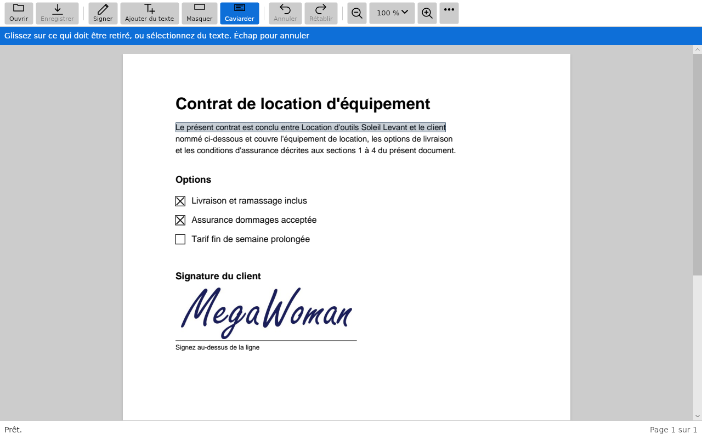
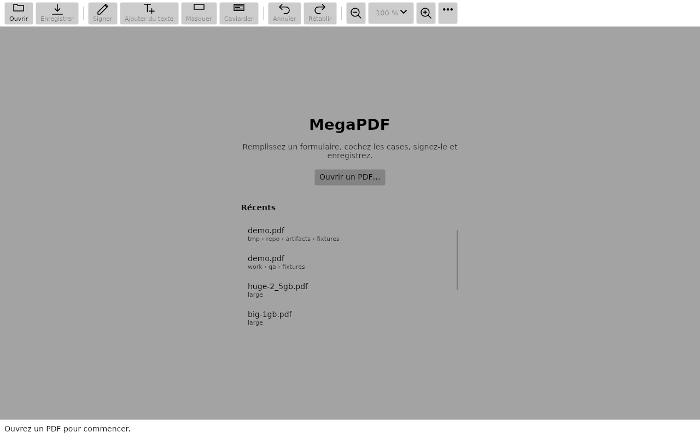
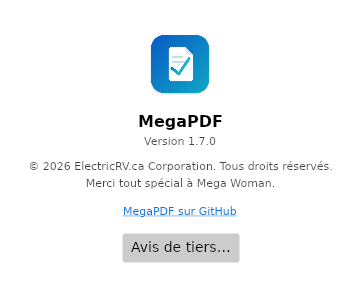
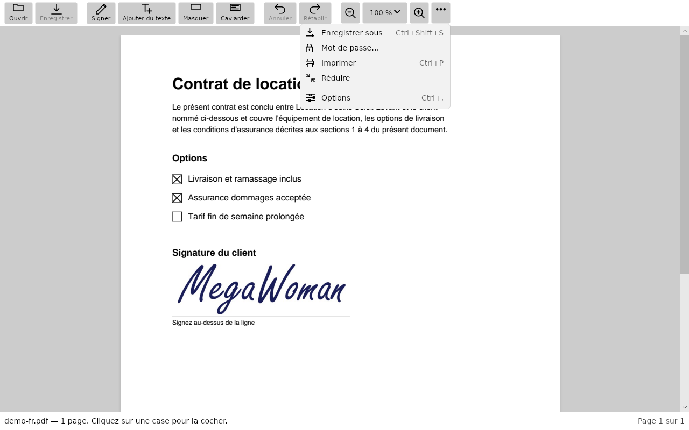
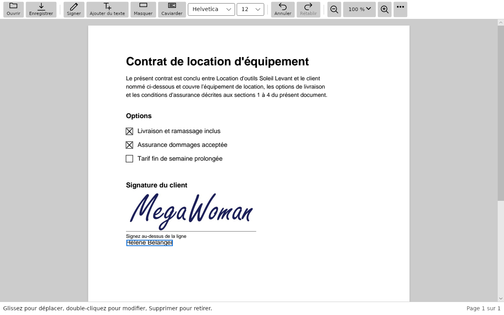
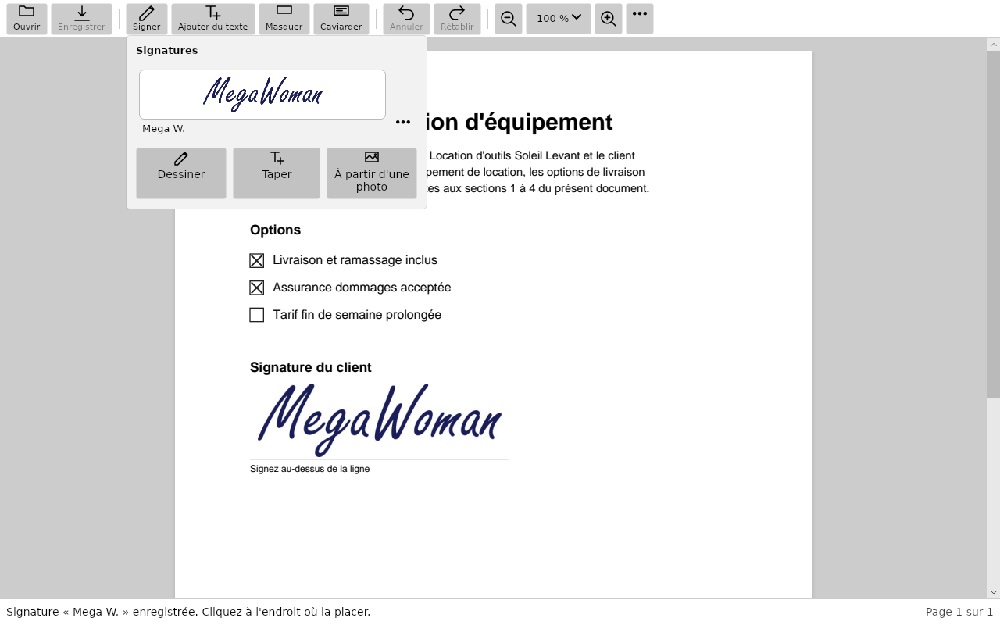
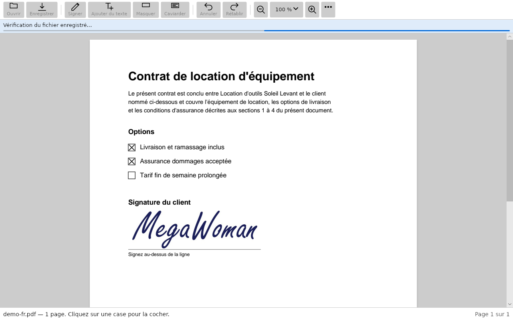
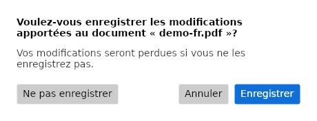
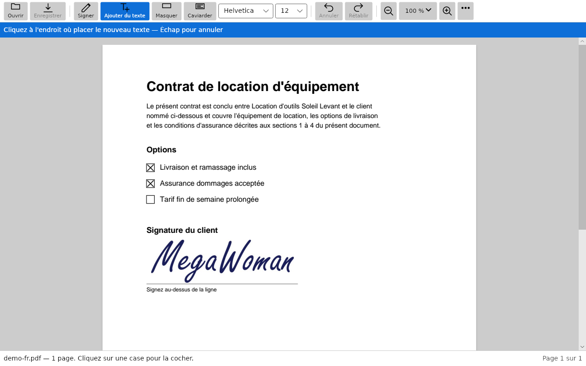
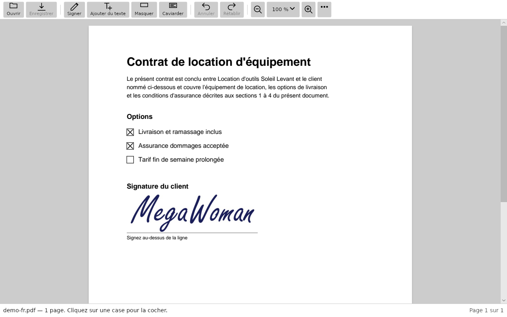

# MegaPDF 2.0 — the French, for a francophone reviewer (#146 §2)

Every French string 2.0 adds or changes, in one place: **230 rows**, fr-CA and fr-FR beside the English. It should take about fifteen minutes to skim.

**What to do:** read §1 closely — those are the **37** that want a native speaker's judgement rather than proofreading. Confirm §2. Then skim §4 for anything that reads wrong, and mark it. Everything in §4 is correct French as far as a build assistant can tell; what it cannot tell is whether it sounds like a person wrote it.

Reply on #146, or edit this file — either is fine.

---

## What is in here, and what is not

Taken from all four catalogues (Windows, macOS/Linux, Android, iOS) at `ios-v1.7.0` and at `main`, compared by **text** rather than by key — the Mac's catalogue nearly doubled since 1.7 and Android's more than doubled, much of it by gaining strings another platform already had. A French sentence you could have read at 1.7 is not new French, whatever key it arrived under.

| | rows | |
|---|---:|---|
| **New in 2.0** | 229 | in §4 |
| **Changed in 2.0** | 1 | in §4, marked |
| Unchanged since 1.7 | 317 | **not here** — you have read them, or they shipped |
| Nothing to review | 39 | **not here** — `OK`, `PDF`, `MegaPDF`, `Helvetica`: the French is the English on purpose |

One row per *sentence*, not per platform: the same English with the same French on four platforms is one thing to read. The **where** column says which apps show it.

`⍽` is a non-breaking space (U+00A0) made visible. The glossary asks for one before `:` in Canadian French, and before `?` `!` `;` as well in France's.

## 1. The 37 rows that need you, not a proofreader

| # | English | Français (Canada) | Français (France) | why it is here |
|---|---|---|---|---|
| 1 | %1$s areas marked for redaction | %1$s zones marquées pour caviardage | same | the glossary marks Caviarder for review |
| 2 | %1$s areas redacted: %2$s | %1$s zones caviardées⍽: %2$s | same | the glossary marks Caviarder for review |
| 3 | -redacted | -caviarde | same | #173 marked it — Appended to the file name offered by Save as a copy (#173); no accents — it is a file name |
| 4 | 1 area marked for redaction | 1 zone marquée pour caviardage | same | #173 marked this string for review |
| 5 | 1 area redacted: %1$s | 1 zone caviardée⍽: %1$s | same | the glossary marks Caviarder for review |
| 6 | 1 area redacted: {0} | 1 zone caviardée⍽: {0} | same | #173 marked it — Shown after saving (#173); {0} is a list such as "41 characters, 1 image" |
| 7 | 1 character | 1 caractère | same | #173 marked this string for review |
| 8 | 1 form field | 1 champ de formulaire | same | #173 marked this string for review |
| 9 | Anything under a whiteout is still in the file, and another app can copy or search it. To take it out of the file, use Redact. | Ce qui est sous un correcteur reste dans le fichier, et une autre application peut le copier ou le chercher. Pour le retirer du fichier, utilisez Caviarder. | same | #173 marked it — First-use hint body (#173) |
| 10 | Drag across the area you want to cover — Esc cancels. Covering doesn't remove; Redact does | Glissez sur la zone à masquer. Échap pour annuler. Masquer ne retire rien⍽: Caviarder le fait | same | the glossary marks Caviarder for review |
| 11 | Drag across what you want removed, or select text — Esc cancels | Glissez sur ce qui doit être retiré, ou sélectionnez du texte. Échap pour annuler | same | #173 marked it — Status hint while the Redact tool is armed (#173) |
| 12 | Drag across what you want removed, select text, or press Enter on the focused item — Esc cancels | Glissez sur ce qui doit être retiré, sélectionnez du texte ou appuyez sur Entrée sur l’élément ciblé. Échap pour annuler | same | #173 marked it — Status hint while the Redact tool is armed (#173) |
| 13 | Drag over what you want to cover — Esc cancels. Covering doesn't remove; Redact does | Glissez sur ce que vous voulez masquer. Échap pour annuler. Masquer ne retire rien⍽: Caviarder le fait | same | the glossary marks Caviarder for review |
| 14 | Jane Whitfield | Hélène Bélanger | Céline Lefèvre | fr-CA and fr-FR use different words; the English changed in 2.0; it was “Jane Whitfield” |
| 15 | Mark removed. | Marque retirée. | same | #173 marked this string for review |
| 16 | Marked for redaction | Marqué pour caviardage | same | #173 marked it — Screen-reader name of a mark on the page (#173) |
| 17 | Marked for redaction. | Marqué pour caviardage. | same | #173 marked it — Announced after a mark is placed (#173) |
| 18 | MegaPDF couldn't remove everything you marked on page {0}, so it removed nothing and left the file as it was. | MegaPDF n'a pas pu tout retirer à la page {0}; rien n'a été retiré et le fichier est resté intact. | MegaPDF n'a pas pu tout retirer à la page {0}⍽; rien n'a été retiré et le fichier est resté intact. | #173 marked it — Refusal body (#173); {0} is a page number |
| 19 | MegaPDF couldn't take that content apart safely. | MegaPDF n'a pas pu décomposer ce contenu sans risque. | same | #173 marked this string for review |
| 20 | nothing | rien | same | #173 marked it — The summary's list when a redaction removed no countable content (#173) |
| 21 | Nothing was removed | Rien n'a été retiré | same | #173 marked it — Shown when a redaction fails closed (#173) |
| 22 | Overwrite the original | Remplacer l'original | same | #173 marked this string for review |
| 23 | Part of that area is drawn from a shared block MegaPDF can't take apart safely. | Une partie de cette zone provient d'un bloc partagé que MegaPDF ne peut pas décomposer sans risque. | same | #173 marked this string for review |
| 24 | Redact | Caviarder | same | #173 marked it — Toolbar (#173): label |
| 25 | Redaction permanently removes the marked content. This can't be undone after saving. | Le caviardage retire définitivement le contenu marqué. Impossible d'annuler après l'enregistrement. | same | #173 marked it — Confirmation body (#173) — the wording #173 specifies |
| 26 | Remove content from the file | Retirer du contenu du fichier | same | #173 marked it — Toolbar (#173): tooltip |
| 27 | Remove the marked content? | Retirer le contenu marqué? | Retirer le contenu marqué⍽? | #173 marked it — Confirmation before a redaction is applied on save (#173) |
| 28 | Removing it would change the page outside the areas you marked. | Le retrait modifierait la page en dehors des zones marquées. | same | #173 marked this string for review |
| 29 | Show in Files | Afficher dans Fichiers | same | the glossary marks Afficher dans Fichiers for review |
| 30 | The redaction couldn't be finished, and this file can no longer be saved. Close it and open it again — nothing was written. | Le caviardage n'a pas pu être terminé et ce fichier ne peut plus être enregistré. Fermez-le et rouvrez-le⍽: rien n'a été écrit. | same | #173 marked it — The fail-closed case the rehearsal says cannot happen (#173) |
| 31 | The text there is in a font MegaPDF can't redraw around your marks. | Le texte à cet endroit utilise une police que MegaPDF ne peut pas redessiner autour de vos marques. | same | #173 marked this string for review |
| 32 | This document doesn't allow changes, so it can't be redacted. | Ce document n'autorise pas les modifications; il ne peut pas être caviardé. | Ce document n'autorise pas les modifications⍽; il ne peut pas être caviardé. | #173 marked this string for review |
| 33 | Whiteout covers — it doesn't remove | Le correcteur masque, il ne retire rien | same | #173 marked it — First-use hint on the Whiteout tool (#173) |
| 34 | {0} areas marked for redaction | {0} zones marquées pour caviardage | same | #173 marked it — Screen-reader summary of the page's marks (#173) |
| 35 | {0} areas redacted: {1} | {0} zones caviardées⍽: {1} | same | #173 marked this string for review |
| 36 | {0} characters | {0} caractères | same | #173 marked this string for review |
| 37 | {0} form fields | {0} champs de formulaire | same | #173 marked this string for review |

**31 of those 37 are redaction (#173)**, and most of them are one question asked many times: **`Caviarder`** for *Redact*, which the glossary has marked *For francophone review* since #173 coined the word. It is now on toolbars, in menus, in summaries and in a saved file's name on four platforms. Settling that one word settles most of this section.

Two rows in there are deliberate and only need a nod rather than a decision:

- **`-caviarde`**, the suffix *Save as a copy* offers after a redaction, has no accent on purpose — it goes into a file name. Both the catalogue comment and the glossary say so. Wrong only if you would rather a French file name carried its accent.
- **Hélène Bélanger / Céline Lefèvre** is the demo signer's name in the store captures, chosen so each French listing shows a name from its own country and so the accented capitals prove they render (#146 §3).

## 2. The four corrections already applied — please confirm

| # | What it was | What it is now | Why |
|---|---|---|---|
| 1 | a plain space before `:`, in **43 strings** on all four platforms | `U+00A0` before `:` | the glossary's first convention, never applied. A plain space lets a line break fall between the word and its colon. macOS's own French does it properly (`Des options vous permettent :`). A test holds it now. — `f2e920f` |
| 2 | iOS: *Fichiers n'a pas pu afficher cet emplacement.* | *Impossible d'afficher cet emplacement dans Fichiers.* | every other failure follows the glossary's *Impossible de…* pattern, and the Mac's version of the same message already did — `f2e920f` |
| 3 | Play notes: *…renommez votre bibliothèque* | *…renommez celles que vous gardez* | a meaning change, not a wording one: the app renames a **signature**, never the library. The English that invited it was tightened too — `1abdb23` |
| 4 | Play long form: *alors* twice in one sentence | once | reads badly — `1abdb23` |

A fifth change was mechanical and is worth knowing about: Quebec writes **no** space before `?` `!` `;` while France writes one, and `fix_french_spacing.py` only ever inserted the space it wanted — it never removed one that did not belong. So `1.7 ;` kept a plain space in the Canadian block. Fixed in `1abdb23`, and it is why **15** rows in §4 differ between fr-CA and fr-FR by punctuation alone.

## 3. Five questions the string audit already left you

Asked in full in the [French audit comment on #146](https://github.com/SlyWombat/MegaPDF/issues/146); one line each here so this pack is complete on its own.

1. **`Masquer` and `Réduire` each mean two things now.** *Masquer* is the Cover tool and *Hide MegaPDF* in the macOS app menu; *Réduire* is Shrink and *Minimize*. The menu words are Apple's and cannot move, so the question is whether the **toolbar** verbs should — *Couvrir*, *Compresser*, *Alléger* — or whether context carries it, as it has for `Annuler` meaning both *Undo* and *Cancel* forever.
2. **Apostrophes.** 207 straight `'` across the Canadian catalogues and not one `’`. Consistent, so it is house style — but Apple's French uses `’` throughout, and on a Mac ours will look slightly off beside the system's.
3. **`Caviarder`** for *Redact* — the §1 question above.
4. **`Afficher dans Fichiers`** for iOS's *Show in Files*. The macOS one is Apple's own wording, confirmed against their catalogue; there is no Apple catalogue for the iOS Files app to confirm this one against.
5. **Length.** Nothing looked like a clipping risk in what could be checked, and the Linux pass since has captured every screen at 1280, 1000, 800 and the 480 minimum in both Frenches with no clipping. **Not** checked: the largest Dynamic Type on iOS and the largest text size on Android, for the screens 2.0 added.

## 4. Everything new, by where it appears

*Français (France)* says **same** when it is identical to the Canadian, which is most of the time. Rows marked **§1** are the ones from section 1.

### Redaction (#173) — 41 rows

*The Redact tool armed, its banner, and a marked line, in Canadian French. `docs/qa/linux-fr/redact.png`.*

| English | Français (Canada) | Français (France) | where | |
|---|---|---|---|---|
| %1$s areas marked for redaction | %1$s zones marquées pour caviardage | same | Andr | **§1** |
| %1$s areas redacted: %2$s | %1$s zones caviardées⍽: %2$s | same | Andr | **§1** |
| %1$s characters | %1$s caractères | same | Andr |  |
| %1$s form fields | %1$s champs de formulaire | same | Andr |  |
| -redacted | -caviarde | same | Andr Win iOS Mac/Linux | **§1** |
| 1 area marked for redaction | 1 zone marquée pour caviardage | same | Andr Win iOS Mac/Linux | **§1** |
| 1 area redacted: %1$s | 1 zone caviardée⍽: %1$s | same | Andr | **§1** |
| 1 area redacted: {0} | 1 zone caviardée⍽: {0} | same | Win iOS Mac/Linux | **§1** |
| Anything under a whiteout is still in the file, and another app can copy or search it. To take it out of the file, use Redact. | Ce qui est sous un correcteur reste dans le fichier, et une autre application peut le copier ou le chercher. Pour le retirer du fichier, utilisez Caviarder. | same | Win iOS Mac/Linux | **§1** |
| Applying… | Application de la modification… | same | Andr Win iOS Mac/Linux |  |
| Cover an area — this doesn't remove what's under it | Masquer une zone⍽: ce qui est dessous n'est pas retiré | same | Win |  |
| Cover selected. Delete removes it, Esc lets it go. | Correcteur sélectionné. Supprimer le retire, Échap le désélectionne. | same | Win |  |
| Drag across the area you want to cover — Esc cancels. Covering doesn't remove; Redact does | Glissez sur la zone à masquer. Échap pour annuler. Masquer ne retire rien⍽: Caviarder le fait | same | Win | **§1** |
| Drag across what you want removed, or select text — Esc cancels | Glissez sur ce qui doit être retiré, ou sélectionnez du texte. Échap pour annuler | same | Andr iOS Mac/Linux | **§1** |
| Drag across what you want removed, select text, or press Enter on the focused item — Esc cancels | Glissez sur ce qui doit être retiré, sélectionnez du texte ou appuyez sur Entrée sur l’élément ciblé. Échap pour annuler | same | Win | **§1** |
| Drag over what you want to cover — Esc cancels. Covering doesn't remove; Redact does | Glissez sur ce que vous voulez masquer. Échap pour annuler. Masquer ne retire rien⍽: Caviarder le fait | same | Mac/Linux | **§1** |
| Marked for redaction | Marqué pour caviardage | same | Andr Win iOS Mac/Linux | **§1** |
| Marked for redaction. | Marqué pour caviardage. | same | Andr Win iOS Mac/Linux | **§1** |
| MegaPDF couldn't remove everything you marked on page %1$s, so it removed nothing and left the file as it was. | MegaPDF n'a pas pu tout retirer à la page %1$s; rien n'a été retiré et le fichier est resté intact. | MegaPDF n'a pas pu tout retirer à la page %1$s⍽; rien n'a été retiré et le fichier est resté intact. | Andr |  |
| MegaPDF couldn't take that content apart safely. | MegaPDF n'a pas pu décomposer ce contenu sans risque. | same | Andr Win iOS Mac/Linux | **§1** |
| nothing | rien | same | Andr Win iOS Mac/Linux | **§1** |
| Nothing was removed | Rien n'a été retiré | same | Andr Win iOS Mac/Linux | **§1** |
| Overwrite the original | Remplacer l'original | same | Andr Win iOS Mac/Linux | **§1** |
| Part of that area is drawn from a shared block MegaPDF can't take apart safely. | Une partie de cette zone provient d'un bloc partagé que MegaPDF ne peut pas décomposer sans risque. | same | Andr Win iOS Mac/Linux | **§1** |
| Redact | Caviarder | same | Andr Win iOS Mac/Linux | **§1** |
| Redaction permanently removes the marked content. This can't be undone after saving. | Le caviardage retire définitivement le contenu marqué. Impossible d'annuler après l'enregistrement. | same | Andr Win iOS Mac/Linux | **§1** |
| Remove content from the file | Retirer du contenu du fichier | same | Andr Win iOS Mac/Linux | **§1** |
| Remove the marked content? | Retirer le contenu marqué? | Retirer le contenu marqué⍽? | Andr Win iOS Mac/Linux | **§1** |
| Removing it would change the page outside the areas you marked. | Le retrait modifierait la page en dehors des zones marquées. | same | Andr Win iOS Mac/Linux | **§1** |
| The redaction couldn't be finished, and this file can no longer be saved. Close it and open it again — nothing was written. | Le caviardage n'a pas pu être terminé et ce fichier ne peut plus être enregistré. Fermez-le et rouvrez-le⍽: rien n'a été écrit. | same | Andr Win iOS Mac/Linux | **§1** |
| The text there is in a font MegaPDF can't redraw around your marks. | Le texte à cet endroit utilise une police que MegaPDF ne peut pas redessiner autour de vos marques. | same | Andr Win iOS Mac/Linux | **§1** |
| This also saves your changes. | Vos modifications seront aussi enregistrées. | same | iOS |  |
| This document doesn't allow changes, so it can't be redacted. | Ce document n'autorise pas les modifications; il ne peut pas être caviardé. | Ce document n'autorise pas les modifications⍽; il ne peut pas être caviardé. | Andr Win iOS Mac/Linux | **§1** |
| This line can't be changed without making other parts of the page look different. Cover it with whiteout and add new text instead. | Cette ligne ne peut pas être modifiée sans changer l'apparence d'autres parties de la page. Masquez-la avec du correcteur et ajoutez un nouveau texte. | same | Win |  |
| This line can't be changed without moving text elsewhere on the page. Cover it with whiteout and add new text instead. | Cette ligne ne peut pas être modifiée sans déplacer du texte ailleurs sur la page. Masquez-la avec du correcteur et ajoutez un nouveau texte. | same | Win |  |
| This page's text can't be changed without disturbing its layout: rewriting it would shift the spacing of other text. Cover it with whiteout and add new text instead. | Le texte de cette page ne peut pas être modifié sans déranger sa mise en page⍽: le réécrire décalerait l'espacement d'autres textes. Masquez-le avec du correcteur et ajoutez un nouveau texte. | same | Win |  |
| Whiteout covers — it doesn't remove | Le correcteur masque, il ne retire rien | same | Win iOS Mac/Linux | **§1** |
| {0} areas marked for redaction | {0} zones marquées pour caviardage | same | Win iOS Mac/Linux | **§1** |
| {0} areas redacted: {1} | {0} zones caviardées⍽: {1} | same | Win iOS Mac/Linux | **§1** |
| {0} characters | {0} caractères | same | Win iOS Mac/Linux | **§1** |
| {0} form fields | {0} champs de formulaire | same | Win iOS Mac/Linux | **§1** |

### Document protection (#131) — 54 rows

| English | Français (Canada) | Français (France) | where | |
|---|---|---|---|---|
| "{0}" is protected by a password. You can change it or remove it. | « {0} » est protégé par un mot de passe. Vous pouvez le modifier ou le retirer. | same | Mac/Linux |  |
| Anyone opening this document will need this password. MegaPDF can't recover it if it's forgotten. | Ce mot de passe sera nécessaire pour ouvrir ce document. MegaPDF ne peut pas le récupérer s'il est oublié. | same | iOS |  |
| Anyone who opens "{0}" will need this password. MegaPDF cannot recover it if it is forgotten. | Toute personne qui ouvre « {0} » aura besoin de ce mot de passe. MegaPDF ne peut pas le récupérer s'il est oublié. | same | Mac/Linux |  |
| Anyone who opens this document will need this password. Setting it saves the document. | Toute personne qui ouvre ce document devra entrer ce mot de passe. Le définir enregistre le document. | same | Andr |  |
| Anyone who opens “{0}” will need this password. MegaPDF can't recover it if it's forgotten. | Toute personne qui ouvre « {0} » aura besoin de ce mot de passe. MegaPDF ne peut pas le récupérer s'il est oublié. | same | Win |  |
| Anyone will be able to open this document without a password. | Tout le monde pourra ouvrir ce document sans mot de passe. | same | iOS |  |
| Change password | Modifier le mot de passe | same | Andr Win Mac/Linux |  |
| Change password… | Modifier le mot de passe… | same | Win Mac/Linux |  |
| Confirm password | Confirmer le mot de passe | same | Andr Win iOS Mac/Linux |  |
| Couldn't change the password | Impossible de modifier le mot de passe | same | Win |  |
| Couldn't unlock this document. | Impossible de déverrouiller ce document. | same | iOS |  |
| Crash recovery is off for password-protected documents, so unsaved changes can't be restored if MegaPDF closes unexpectedly. | La récupération après une fermeture inattendue est désactivée pour les documents protégés par mot de passe; les modifications non enregistrées ne pourront pas être restaurées. | La récupération après une fermeture inattendue est désactivée pour les documents protégés par mot de passe⍽; les modifications non enregistrées ne pourront pas être restaurées. | Win |  |
| Crash recovery is off for password-protected documents. | La récupération après une fermeture inattendue est désactivée pour les documents protégés par mot de passe. | same | Mac/Linux |  |
| Document password | Mot de passe du document | same | Andr Win Mac/Linux |  |
| Document unlocked. | Document déverrouillé. | same | iOS |  |
| Drive › Permission slips | Drive › Autorisations | same | Andr |  |
| Enter a password. | Entrez un mot de passe. | same | Andr Win Mac/Linux |  |
| Enter the owner password to allow every change to this document. | Entrez le mot de passe du propriétaire pour permettre toutes les modifications de ce document. | same | Andr |  |
| New password | Nouveau mot de passe | same | Andr Win Mac/Linux |  |
| Owner password | Mot de passe du propriétaire | same | Andr iOS |  |
| Password changed. | Mot de passe modifié. | same | Andr Win Mac/Linux |  |
| Password changed. | Mot de passe changé. | same | iOS |  |
| Password removed. | Mot de passe retiré. | same | Andr Win iOS Mac/Linux |  |
| Password set. | Mot de passe défini. | same | Andr Win iOS Mac/Linux |  |
| Password… | Mot de passe… | same | Andr Win iOS Mac/Linux |  |
| Remove password | Retirer le mot de passe | same | Andr Win Mac/Linux |  |
| Set a password | Définir un mot de passe | same | Andr |  |
| Set password | Définir un mot de passe | same | Win iOS Mac/Linux |  |
| Set password | Définir le mot de passe | same | Andr Win Mac/Linux |  |
| Set, change or remove the document's password | Définir, modifier ou retirer le mot de passe du document | same | Win Mac/Linux |  |
| That isn't the owner password. Try again. | Ce n'est pas le mot de passe du propriétaire. Réessayez. | same | Andr |  |
| That password did not unlock "{0}". Try again? | Ce mot de passe n'a pas déverrouillé « {0} ». Réessayer? | Ce mot de passe n'a pas déverrouillé « {0} ». Réessayer⍽? | Mac/Linux |  |
| That password didn't unlock the document — try again. | Ce mot de passe n'a pas déverrouillé le document. Réessayez. | same | Win |  |
| The document's owner does not allow that. Unlock it with the owner password first. | Le propriétaire du document ne permet pas cette action. Déverrouillez-le d'abord avec le mot de passe du propriétaire. | same | Mac/Linux |  |
| The document's owner doesn't allow this. Unlock it with the owner password first. | Le propriétaire du document ne permet pas cette action. Déverrouillez-le d'abord avec le mot de passe du propriétaire. | same | Win |  |
| The owner of "{0}" restricted what can be done with it. Enter the owner password to use every tool. | Le propriétaire de « {0} » a restreint ce qu'on peut en faire. Entrez le mot de passe du propriétaire pour utiliser tous les outils. | same | Mac/Linux |  |
| The owner of this document has restricted changes. Unlock it with the owner password to edit it. | Le propriétaire de ce document a restreint les modifications. Déverrouillez-le avec le mot de passe du propriétaire pour le modifier. | same | iOS |  |
| The owner of this document restricted changes to it. To edit it, unlock it with the owner password from the menu. | Le propriétaire de ce document en a restreint les modifications. Pour le modifier, déverrouillez-le avec le mot de passe du propriétaire à partir du menu. | same | Andr |  |
| The owner of this document restricted it, so some tools are unavailable. | Le propriétaire de ce document l'a restreint; certains outils ne sont pas disponibles. | Le propriétaire de ce document l'a restreint⍽; certains outils ne sont pas disponibles. | Win Mac/Linux |  |
| The owner of this document restricted it. Without the owner password, its password can't be set, changed or removed. | Le propriétaire de ce document l'a restreint. Sans le mot de passe du propriétaire, son mot de passe ne peut pas être défini, modifié ni retiré. | same | Andr |  |
| The owner of this document restricted what can be changed in it. Enter the owner password to unlock it. | Le propriétaire de ce document a restreint ce qui peut y être modifié. Entrez le mot de passe du propriétaire pour le déverrouiller. | same | iOS |  |
| The owner of “{0}” restricted what can be done with it. Enter the owner password to use every tool. | Le propriétaire de « {0} » a restreint ce qu'on peut en faire. Entrez le mot de passe du propriétaire pour utiliser tous les outils. | same | Win |  |
| The passwords do not match. | Les mots de passe ne correspondent pas. | same | Mac/Linux |  |
| The passwords don't match. | Les mots de passe ne correspondent pas. | same | Andr Win iOS |  |
| This document is protected with a password. Changing or removing it saves the document. | Ce document est protégé par un mot de passe. Le modifier ou le retirer enregistre le document. | same | Andr |  |
| This document's owner doesn't allow that change. Unlock it with the owner password first. | Le propriétaire de ce document ne permet pas cette modification. Déverrouillez-le d'abord avec le mot de passe du propriétaire. | same | Andr |  |
| This document's security doesn't allow that without its owner password. | La sécurité de ce document ne le permet pas sans le mot de passe du propriétaire. | same | iOS |  |
| Unlock | Déverrouiller | same | Andr Win iOS Mac/Linux |  |
| Unlock document | Déverrouiller le document | same | Andr Win iOS Mac/Linux |  |
| Unlock with owner password… | Déverrouiller avec le mot de passe du propriétaire… | same | Andr iOS |  |
| Unlocked. Every tool is available. | Document déverrouillé. Tous les outils sont disponibles. | same | Mac/Linux |  |
| Unlock… | Déverrouiller… | same | Andr Win Mac/Linux |  |
| Unsaved changes will be lost. | Les modifications non enregistrées seront perdues. | same | Andr |  |
| “{0}” is protected by a password. You can change it or remove it. | « {0} » est protégé par un mot de passe. Vous pouvez le modifier ou le retirer. | same | Win |  |

### Recent documents and locations (#165) — 24 rows

*The empty state, with each recent document's location under its name, in Canadian French. `docs/qa/linux-fr/empty.png`.*

| English | Français (Canada) | Français (France) | where | |
|---|---|---|---|---|
| %1$s, in %2$s | %1$s, dans %2$s | same | Andr |  |
| %1$s, not found | %1$s, introuvable | same | Andr |  |
| %@, in %@ | %@, dans %@ | same | iOS |  |
| %@, not found | %@, introuvable | same | iOS |  |
| %@, not found, in %@ | %@, introuvable, dans %@ | same | iOS |  |
| Archive | Archives | same | iOS |  |
| Can't find this file | Impossible de trouver ce fichier | same | Win |  |
| Couldn't show {0} in the Finder. | Impossible d'afficher {0} dans le Finder. | same | Mac/Linux |  |
| Downloads | Téléchargements | same | Andr iOS |  |
| Files couldn't show that location. | Impossible d'afficher cet emplacement dans Fichiers. | same | iOS |  |
| Internal storage | Stockage interne | same | Andr |  |
| Location unknown | Emplacement inconnu | same | Andr |  |
| Not found · %@ | Introuvable · %@ | same | iOS |  |
| On My iPad | Sur mon iPad | same | iOS |  |
| On My iPhone | Sur mon iPhone | same | iOS |  |
| Options for %1$s | Options pour %1$s | same | Andr |  |
| Remove from Recent | Retirer des récents | same | Win |  |
| Remove from Recents | Retirer des récents | same | Andr iOS |  |
| Show in Files | Afficher dans Fichiers | same | iOS | **§1** |
| Show in Finder | Afficher dans le Finder | same | Mac/Linux |  |
| That file isn't at that location any more. | Ce fichier ne se trouve plus à cet emplacement. | same | Andr |  |
| {0}, in {1} | {0}, dans {1} | same | Win Mac/Linux |  |
| {0}, in {1}, not found | {0}, dans {1}, introuvable | same | Win |  |
| “{0}” is no longer in {1}. It may have been moved, renamed or deleted. | «⍽{0}⍽» ne se trouve plus dans {1}. Le fichier a peut-être été déplacé, renommé ou supprimé. | same | Win |  |

### About and third-party notices (#176) — 1 rows

*The About window, in Canadian French. `docs/qa/linux-fr/about.png`.*

The third-party notices window beside it is **English in a French run**, on purpose: it reproduces the licence texts as those licences require. `docs/qa/linux-fr/notices.png`.

| English | Français (Canada) | Français (France) | where | |
|---|---|---|---|---|
| Third-Party Notices… | Avis de tiers… | same | Mac/Linux |  |

### Toolbar, More and zoom (#144) — 25 rows

*The toolbar at 1280 and the More menu open, in Canadian French. `docs/qa/linux-fr/more.png`.*

| English | Français (Canada) | Français (France) | where | |
|---|---|---|---|---|
| Close more options | Fermer les options supplémentaires | same | Win |  |
| Couldn't print | Impossible d'imprimer | same | Win |  |
| Edit | Édition | same | Mac/Linux |  |
| File | Fichier | same | Mac/Linux |  |
| Help | Aide | same | Mac/Linux |  |
| Hide Others | Masquer les autres | same | Mac/Linux |  |
| Hide {0} | Masquer {0} | same | Mac/Linux |  |
| Mark removed. | Marque retirée. | same | Andr Win iOS Mac/Linux | **§1** |
| More | Plus | same | iOS Mac/Linux |  |
| More options for %@ | Autres options pour %@ | same | iOS |  |
| No printers are set up on this computer. | Aucune imprimante n'est configurée sur cet ordinateur. | same | Mac/Linux |  |
| Printer | Imprimante | same | Mac/Linux |  |
| Printing from inside the sandbox is not available in this build yet. | L'impression depuis le bac à sable n'est pas encore offerte dans cette version. | same | Mac/Linux |  |
| Printing from this build is available on macOS and Linux only. | L'impression n'est offerte que sur macOS et Linux dans cette version. | same | Mac/Linux |  |
| Printing needs the CUPS printing system. Install the cups-client package and try again. | L'impression nécessite le système d'impression CUPS. Installez le paquet cups-client, puis réessayez. | same | Mac/Linux |  |
| Quit {0} | Quitter {0} | same | Mac/Linux |  |
| Show All | Tout afficher | same | Mac/Linux |  |
| The print queue did not answer. | La file d'impression n'a pas répondu. | same | Mac/Linux |  |
| Tools | Outils | same | Mac/Linux |  |
| View | Présentation | same | Mac/Linux |  |
| Window | Fenêtre | same | Mac/Linux |  |
| Zoom in (Ctrl+Plus) | Zoom avant (Ctrl+Plus) | same | Win |  |
| Zoom level | Niveau de zoom | same | Win Mac/Linux |  |
| Zoom out (Ctrl+Minus) | Zoom arrière (Ctrl+Moins) | same | Win |  |
| {0}% | {0}⍽% | same | Win Mac/Linux |  |

### Editing the document's own text (#125, #128, #139) — 13 rows

*A placed text box selected, with the face and size pickers and the status hint, in Canadian French. `docs/qa/linux-fr/textbox.png`.*

| English | Français (Canada) | Français (France) | where | |
|---|---|---|---|---|
| Change this line. The size and font stay as they are. | Modifiez cette ligne. La taille et la police restent les mêmes. | same | Andr iOS |  |
| Change this page? | Modifier cette page? | Modifier cette page⍽? | Andr Win iOS Mac/Linux |  |
| Changing this page may slightly alter parts of it you haven't touched. | Modifier cette page pourrait légèrement changer des parties que vous n'avez pas touchées. | same | Andr Win iOS Mac/Linux |  |
| Couldn't make that change | Impossible d'effectuer cette modification | same | Win |  |
| Couldn't make that change. | Impossible d'effectuer cette modification. | same | Andr |  |
| The original font couldn't show this text, so a similar standard font was used. | La police d'origine ne pouvait pas afficher ce texte; une police standard semblable a été utilisée. | La police d'origine ne pouvait pas afficher ce texte⍽; une police standard semblable a été utilisée. | Andr iOS |  |
| This line can't be changed without making other parts of the page look different. | Cette ligne ne peut pas être modifiée sans changer l'apparence d'autres parties de la page. | same | Andr iOS |  |
| This line can't be changed without making other parts of the page look different. You can cover it and type over the top instead. | Cette ligne ne peut pas être modifiée sans changer l'apparence d'autres parties de la page. Vous pouvez plutôt la masquer et écrire par-dessus. | same | Mac/Linux |  |
| This line can't be changed without moving text elsewhere on the page. | Cette ligne ne peut pas être modifiée sans déplacer du texte ailleurs sur la page. | same | Andr iOS |  |
| This line can't be changed without moving text elsewhere on the page. You can cover it and type over the top instead. | Cette ligne ne peut pas être modifiée sans déplacer du texte ailleurs sur la page. Vous pouvez plutôt la masquer et écrire par-dessus. | same | Mac/Linux |  |
| This page is a scanned image, so its text can't be edited. | Cette page est une image numérisée; son texte ne peut pas être modifié. | Cette page est une image numérisée⍽; son texte ne peut pas être modifié. | Andr iOS |  |
| This page's text can't be changed without disturbing its layout. | Le texte de cette page ne peut pas être modifié sans déranger sa mise en page. | same | Andr iOS |  |
| This page's text can't be changed without disturbing its layout. You can cover it and type over the top instead. | Le texte de cette page ne peut pas être modifié sans déranger sa mise en page. Vous pouvez plutôt le masquer et écrire par-dessus. | same | Mac/Linux |  |

### Signatures — 32 rows

*The signature library flyout and its three ways in, in Canadian French. `docs/qa/linux-fr/sign.png`.*

| English | Français (Canada) | Français (France) | where | |
|---|---|---|---|---|
| %1$s. Tap to place, long-press for options. | %1$s. Touchez pour placer, maintenez pour les options. | same | Andr |  |
| Add a signature from a photo | Ajouter une signature à partir d'une photo | same | Win |  |
| Couldn't move this signature | Impossible de déplacer cette signature | same | Andr |  |
| Couldn't rename that signature | Impossible de renommer cette signature | same | Win |  |
| Delete "{0}"? This cannot be undone. | Supprimer « {0} »? Cette action est irréversible. | Supprimer « {0} »⍽? Cette action est irréversible. | Mac/Linux |  |
| Delete %1$s? | Supprimer %1$s? | Supprimer %1$s⍽? | Andr |  |
| Delete %@? | Supprimer %@? | Supprimer %@⍽? | iOS |  |
| Delete signature | Supprimer la signature | same | Mac/Linux |  |
| Delete {0}? | Supprimer {0}? | Supprimer {0}⍽? | Win |  |
| Delete… | Supprimer… | same | Mac/Linux |  |
| Draw a signature | Dessiner une signature | same | Win |  |
| Draw a signature with your mouse, finger, or pen | Dessinez une signature avec la souris, le doigt ou un stylet | same | Win |  |
| From photo | À partir d'une photo | same | iOS Mac/Linux |  |
| From photo | D'une photo | same | Win |  |
| No signatures yet. Draw one with the trackpad, or use a photo of your signature on white paper — the background is removed automatically. | Aucune signature pour l'instant. Dessinez-en une avec le pavé tactile, ou utilisez une photo de votre signature sur papier blanc — l'arrière-plan est retiré automatiquement. | same | Mac/Linux |  |
| No signatures yet. Draw one, type your name, or add a photo of your signature on white paper — the background is removed automatically. | Aucune signature pour l'instant. Dessinez-en une, tapez votre nom ou ajoutez une photo de votre signature sur papier blanc — l'arrière-plan est retiré automatiquement. | same | Win |  |
| Place on the page | Placer sur la page | same | Andr |  |
| Places it on the page | La place sur la page | same | iOS |  |
| Rename | Renommer | same | Andr Win iOS Mac/Linux |  |
| Rename or delete | Renommer ou supprimer | same | Win |  |
| Rename signature | Renommer la signature | same | Andr Win iOS Mac/Linux |  |
| Renamed to "{0}". | Renommée « {0} ». | same | Mac/Linux |  |
| Rename… | Renommer… | same | Mac/Linux |  |
| Signature options | Options de la signature | same | Win Mac/Linux |  |
| Signature selected. Arrow keys move it, Delete removes it, Esc lets it go. | Signature sélectionnée. Les flèches la déplacent, Supprimer la retire, Échap la désélectionne. | same | Win |  |
| Tab to where the signature goes on the page, then press Enter. | Avec Tab, allez à l'endroit où placer la signature, puis appuyez sur Entrée. | same | Win |  |
| This cannot be undone. | Cette action est irréversible. | same | Andr Win iOS |  |
| Type | Taper | same | Andr Win iOS Mac/Linux |  |
| Type a signature | Taper une signature | same | Win |  |
| Type your name in a handwriting face | Tapez votre nom dans une police manuscrite | same | Win |  |
| Use a photo or scan of your signature | Utilisez une photo ou une numérisation de votre signature | same | Win |  |
| Your name, as a signature | Votre nom, en guise de signature | same | Andr iOS Mac/Linux |  |

### Busy states (#145) — 7 rows

*The busy strip under the toolbar, with everything disabled, in Canadian French. `docs/qa/linux-fr/busy.png`.*

| English | Français (Canada) | Français (France) | where | |
|---|---|---|---|---|
| Checking the saved file… | Vérification du fichier enregistré… | same | Andr Win iOS Mac/Linux |  |
| Checking this page… | Vérification de cette page… | same | Andr Win iOS Mac/Linux |  |
| Making a smaller copy… | Création d'une copie réduite… | same | Win Mac/Linux |  |
| Opening… | Ouverture… | same | Andr Win iOS Mac/Linux |  |
| Preparing to print… | Préparation de l'impression… | same | Win Mac/Linux |  |
| Restoring your edits… | Restauration de vos modifications… | same | Win Mac/Linux |  |
| Searching… | Recherche… | same | Andr Win iOS Mac/Linux |  |

### Errors and prompts — 7 rows

*The unsaved-changes dialog, in Canadian French. `docs/qa/linux-fr/unsaved.png`.*

| English | Français (Canada) | Français (France) | where | |
|---|---|---|---|---|
| Couldn't restore your edits | Impossible de restaurer vos modifications | same | Win |  |
| Couldn't search this document. | Impossible de rechercher dans ce document. | same | Andr |  |
| Do you want to save the changes made to the document “{0}”? | Voulez-vous enregistrer les modifications apportées au document «⍽{0}⍽»? | Voulez-vous enregistrer les modifications apportées au document «⍽{0}⍽»⍽? | Mac/Linux |  |
| The change could not be made. | La modification n'a pas pu être effectuée. | same | Mac/Linux |  |
| This file is too large for MegaPDF to open. | Ce fichier est trop volumineux pour que MegaPDF puisse l'ouvrir. | same | Andr Win iOS Mac/Linux |  |
| This page couldn't be displayed. | Cette page n'a pas pu être affichée. | same | Win Mac/Linux |  |
| This PDF uses a kind of protection MegaPDF can't open. | Ce PDF utilise un type de protection que MegaPDF ne peut pas ouvrir. | same | Andr Win iOS Mac/Linux |  |

### Screen-reader names and hints — 14 rows

| English | Français (Canada) | Français (France) | where | |
|---|---|---|---|---|
| Document pages | Pages du document | same | Win |  |
| Page down | Une page vers le bas | same | Mac/Linux |  |
| Page left | Une page vers la gauche | same | Mac/Linux |  |
| page region | zone de la page | same | Win |  |
| Page right | Une page vers la droite | same | Mac/Linux |  |
| Page up | Une page vers le haut | same | Mac/Linux |  |
| Page {0}, {1}: {2} | Page {0}, {1}⍽: {2} | same | Win |  |
| Saved {0} | {0} enregistré | same | Win |  |
| Scroll down | Défiler vers le bas | same | Mac/Linux |  |
| Scroll left | Défiler vers la gauche | same | Mac/Linux |  |
| Scroll right | Défiler vers la droite | same | Mac/Linux |  |
| Scroll up | Défiler vers le haut | same | Mac/Linux |  |
| Tab moves between fields, checkboxes and text. Enter or Space activates. Esc returns to the toolbar. | Tab passe d'un champ, d'une case ou d'un texte à l'autre. Entrée ou Espace l'active. Échap revient à la barre d'outils. | same | Win |  |
| {0}, signature. Click to place it on the page. | {0}, signature. Cliquez pour la placer sur la page. | same | Mac/Linux |  |

### Demo content in the store captures (#146 §3) — 3 rows

*The demo agreement, as the store captures show it, in Canadian French. `docs/qa/linux-fr/mode.png`.*

| English | Français (Canada) | Français (France) | where | |
|---|---|---|---|---|
| customer named | client nommé | same | Andr iOS |  |
| Equipment Rental Agreement (2026) | Contrat de location d'équipement (2026) | same | Andr iOS |  |
| Jane Whitfield | Hélène Bélanger | Céline Lefèvre | Andr iOS | **§1** *reworded* |

### Everything else — 9 rows

*The main window, in Canadian French. `docs/qa/linux-fr/doc.png`.*

| English | Français (Canada) | Français (France) | where | |
|---|---|---|---|---|
| 1 character | 1 caractère | same | Andr Win iOS Mac/Linux | **§1** |
| 1 form field | 1 champ de formulaire | same | Andr Win iOS Mac/Linux | **§1** |
| Change | Changer | same | iOS |  |
| Continue | Continuer | same | Andr Win iOS Mac/Linux |  |
| MegaPDF couldn't remove everything you marked on page {0}, so it removed nothing and left the file as it was. | MegaPDF n'a pas pu tout retirer à la page {0}; rien n'a été retiré et le fichier est resté intact. | MegaPDF n'a pas pu tout retirer à la page {0}⍽; rien n'a été retiré et le fichier est resté intact. | Win iOS Mac/Linux | **§1** |
| Remove | Retirer | same | iOS |  |
| Set | Définir | same | iOS |  |
| Text selected. Arrow keys move it, Enter edits it, Delete removes it, Esc lets it go. | Texte sélectionné. Les flèches le déplacent, Entrée le modifie, Supprimer le retire, Échap le désélectionne. | same | Win |  |
| Type your name | Tapez votre nom | same | Andr iOS Mac/Linux |  |

## 5. What was not checked, and cannot be from here

- **Idiom and register.** Whether this sounds like a person wrote it, or like a translation. Nothing mechanical can answer that, and it is the main reason this pack exists.
- **Ambiguity out of context.** Every row above was read as a sentence. Some are fragments — a button, a menu item, half a status line — and a fragment can be correct and still be the wrong word for where it sits. The captures are there for exactly those; the ones with no capture (screen-reader names, several protection messages) are the rows where this risk is highest.
- **Whether the vocabulary suits Quebec specifically.** The glossary follows OQLF and Termium, but it was assembled here, not by a francophone.
- **The store copy itself.** `docs/release-notes/2.0/` has its own reviewer section with three questions, including whether the right thing was dropped from the Play bullets to fit 500 characters.
- **The largest accessibility text sizes** on iOS and Android, for the screens 2.0 added — #167 was exactly that class of bug.

---

The captures are from the Linux 2.0 QA pass (#158), Canadian French, light theme, 1280 px. They show the shared strings; Windows, macOS, Android and iOS draw the same words in their own chrome.
